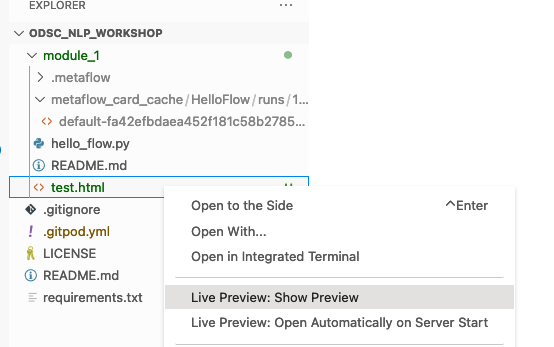
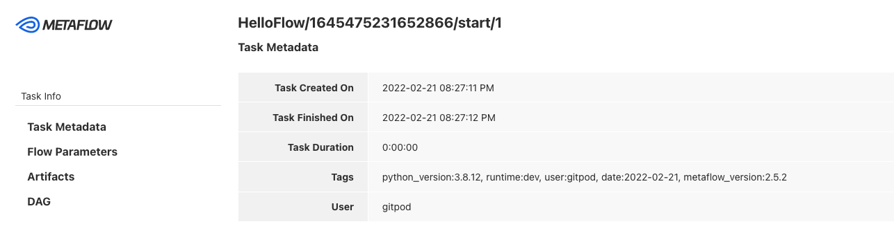

# Getting Started with Metaflow

We will be going through a "hello world" example of using Metaflow. Metaflow operates as directed graph of operations. This is a natural paradigm for expressing data processing pipelines.  

We call the graph of operations a **flow**. You define the operations, called **steps**, which are nodes of the graph and contain transitions to the next steps, which serve as edges. Each flow must have a **start** and **end** operation. To learn more visit [here](https://docs.metaflow.org/metaflow/basics)

## Steps

1. Run the show command to see the steps of your pipeline

```bash
python hello_flow.py show
```

2. Run the pipeline to see the output

```bash
python hello_flow.py run
```

3. Run the card command to generate card html

```bash
python hello_flow.py card get start test.html
```

4. View card html in browser

[]  

[]


5. Play around by adding another step, and changing my_var

